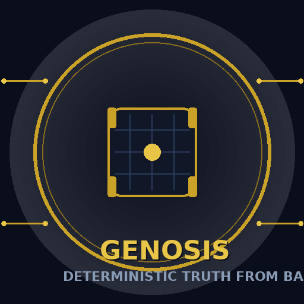

  

# Genosis

> **Building absolute deterministic truth from bare metal.**
> *从裸金属构建绝对确定性真理。*

## Name & Meaning

**Genosis**（读音 /dʒɪˈnoʊsɪs/）是一个合成词：

- **"Gen"** ← *genesis / generate*（起源、生成）——系统从零开始，在裸金属（bare metal）之上逐层生成自身
- **"Osis"** ← *metamorphosis / symbiosis*（演变、共生）——状态转变与各层次之间的共生关系

合起来，**Genosis** 表达的是：*在无任何预设的裸硬件上，通过确定性的逐层构建，生成一个完全可预测、可追溯的操作系统*。它的名字即它的使命——**绝对确定性（absolute deterministic truth）**。

## Project Goal

本项目是用 **Rust** 从零实现的操作系统，核心目标：

- **裸金属起家**：不依赖任何现有 OS，从 bootloader 到内核完全自建
- **绝对确定性**：每一层的行为可预测、可复现——同样的输入永远得到同样的输出
- **裸机认知**：通过亲手实现，深入理解硬件抽象之下的真实机制（中断、分页、调度、驱动）

## Why Rust

Rust 的所有权与借用检查在编译期消除内存安全错误，为"确定性"提供语言级保证：
零成本抽象 + 无 GC + 无未定义行为 → 内核的行为边界清晰可证。

## Status

🚧 Work in progress — 正在从 bare metal 逐层构建。

## References

- [Omarchy](https://github.com/omacom/omarchy) — Beautiful, Modern & Opinionated Linux（DHH 发起）。作为 Genosis 的**设计理念参考**：它展示了"有主见的（opinionated）"系统设计如何通过清晰的取舍与美学追求，塑造一个既现代又易用的 Linux 体验；Genosis 在追求确定性内核的同时，参考其在系统结构、工具链与用户体验上的现代实践。

## License

MIT
